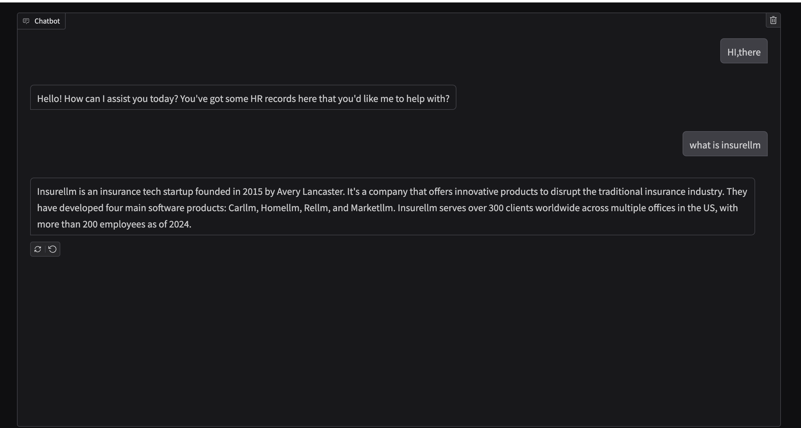

# InsureLLM: Knowledge Assistant [(Demo)](https://drive.google.com/file/d/1CLrgC36yhEiFpNlJCPIJLkhDR4HHj8_c/view?usp=sharing)

- Developed a FastAPI /chat endpoint for a LangChain RAG chatbot powered by Llama3.1 and Chroma, enabling real-time source-grounded QA from markdown knowledge base
- Gradio 前端介面 -> HTTP POST 請求到 /chat -> FastAPI 後端 (main.py → /chat) -> LangChain + ChromaDB回傳答案 (RAG) -> Gradio 顯示結果
